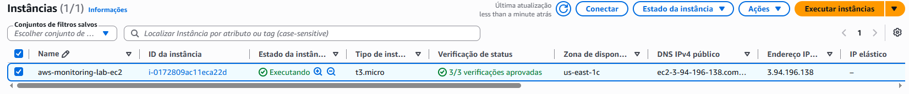
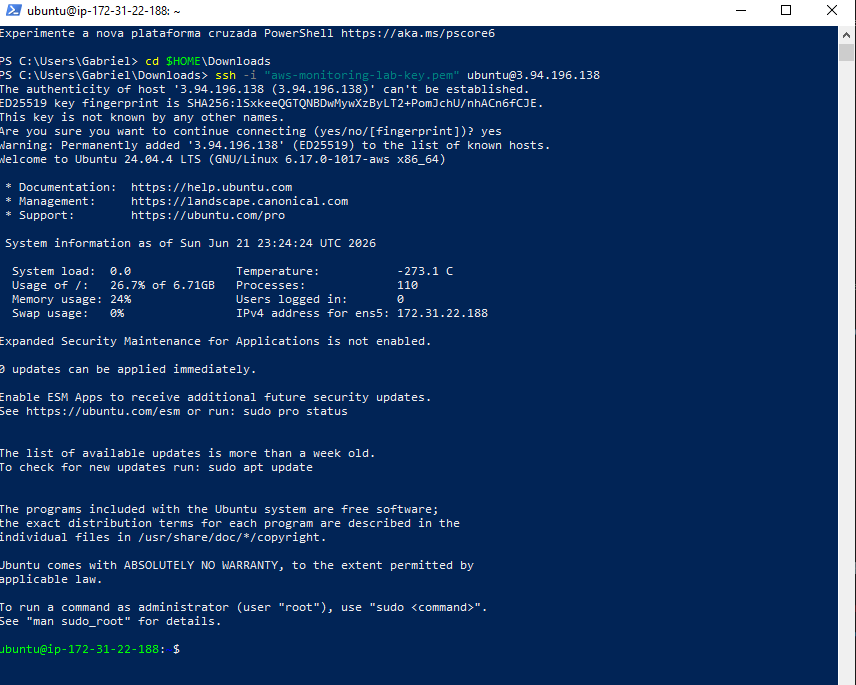
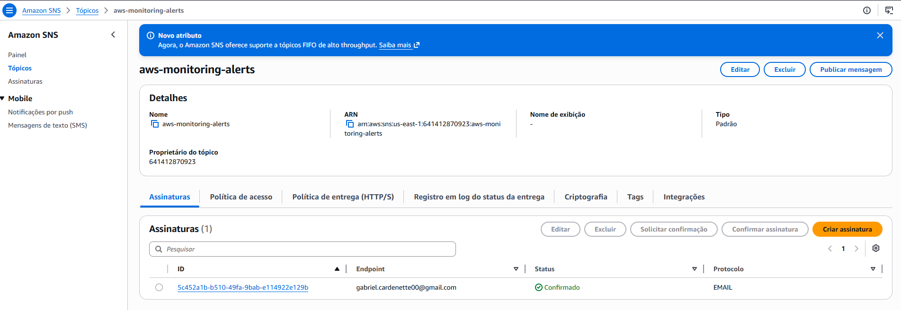
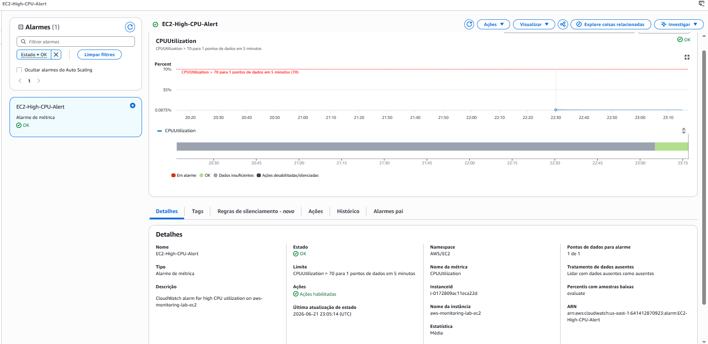
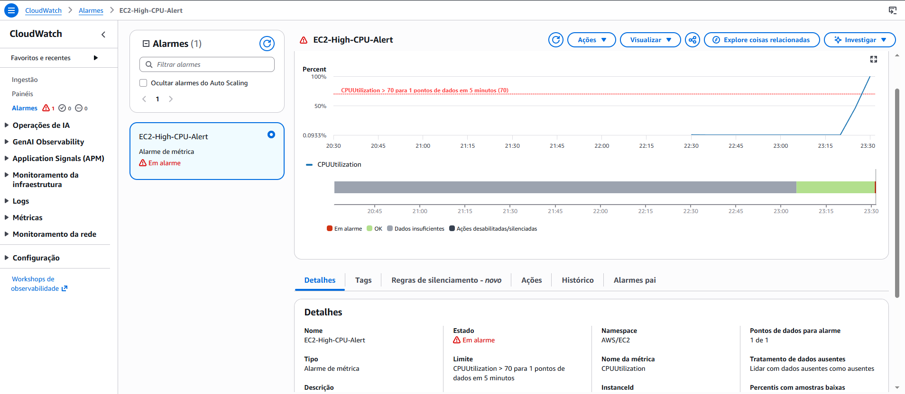
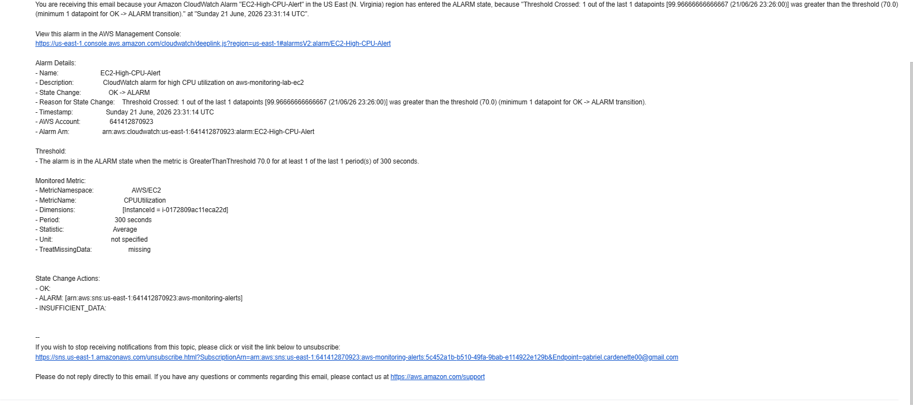

# AWS Monitoring Lab

Hands-on AWS monitoring project using Amazon EC2, Amazon CloudWatch and Amazon SNS.

## Objective

Demonstrate the implementation of a monitoring solution capable of detecting high CPU utilization on an EC2 instance and automatically sending email notifications through Amazon SNS.

## Architecture

```text
EC2 Instance
     │
     ▼
CloudWatch Metrics
     │
     ▼
CloudWatch Alarm
     │
     ▼
SNS Topic
     │
     ▼
Email Notification
```

## AWS Services Used

* Amazon EC2
* Amazon CloudWatch
* Amazon SNS
* AWS IAM

## Implementation Steps

### 1. EC2 Provisioning

* Created an Ubuntu 24.04 LTS EC2 instance
* Configured Security Group for SSH access
* Connected to the instance using a PEM key

### 2. SNS Configuration

* Created an SNS Topic
* Added email subscription
* Confirmed subscription via email

### 3. CloudWatch Alarm Configuration

* Selected CPUUtilization metric
* Configured threshold above 70%
* Linked alarm to SNS Topic

### 4. Alarm Validation

A CPU stress test was executed to trigger the alarm and validate the monitoring workflow.

```bash
yes > /dev/null &
```

## Results

The CloudWatch Alarm successfully detected CPU utilization above the configured threshold and automatically sent an email notification through Amazon SNS.

## Evidence

### EC2 Instance Running



### SSH Connection Successful



### SNS Topic and Subscription Confirmed



### CloudWatch Alarm Created



### CloudWatch Alarm Triggered



### Email Notification Received




## Skills Demonstrated

* Amazon EC2
* Amazon CloudWatch
* Amazon SNS
* Monitoring and Alerting
* Linux Administration
* SSH Access Management
* Cloud Operations

## Author

Gabriel Paes Cardenette

LinkedIn:
linkedin.com/in/gabriel-paes-cardenette-b604b6235

### Certifications

* AWS Certified Cloud Practitioner (CLF-C02)
* Cisco Networking Basics
* Cisco Introduction to Cybersecurity

### Technologies

* AWS
* Linux
* CloudWatch
* SNS
* EC2
* IAM
* SSH

